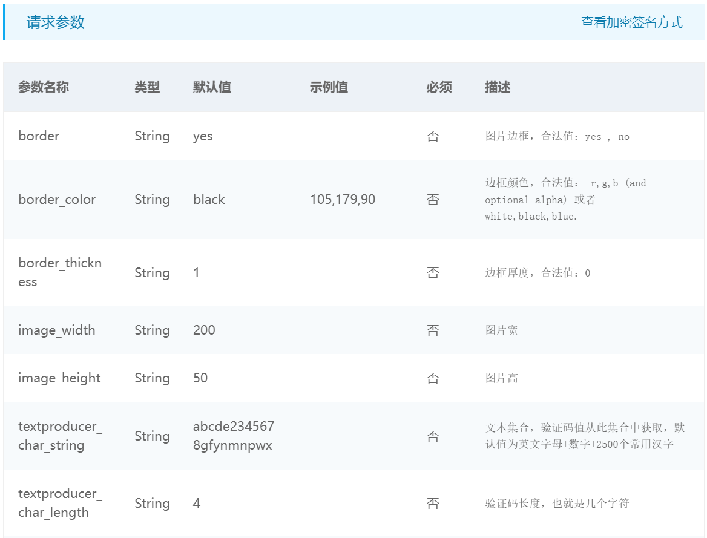
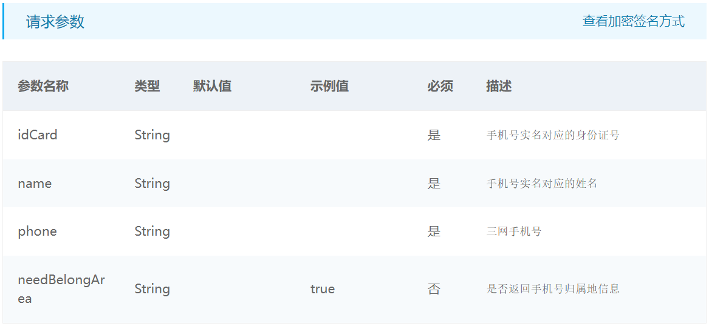
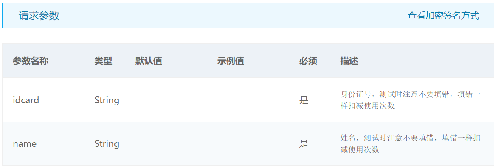
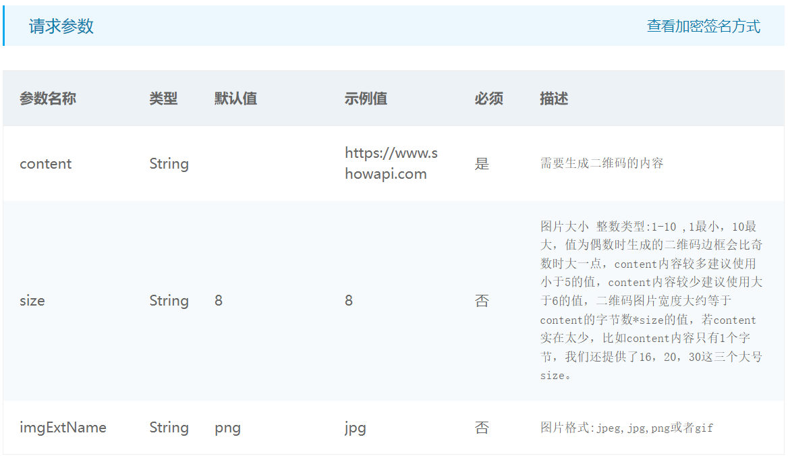
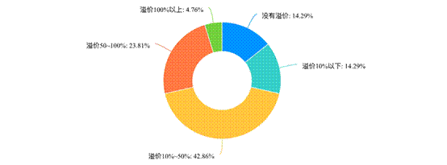
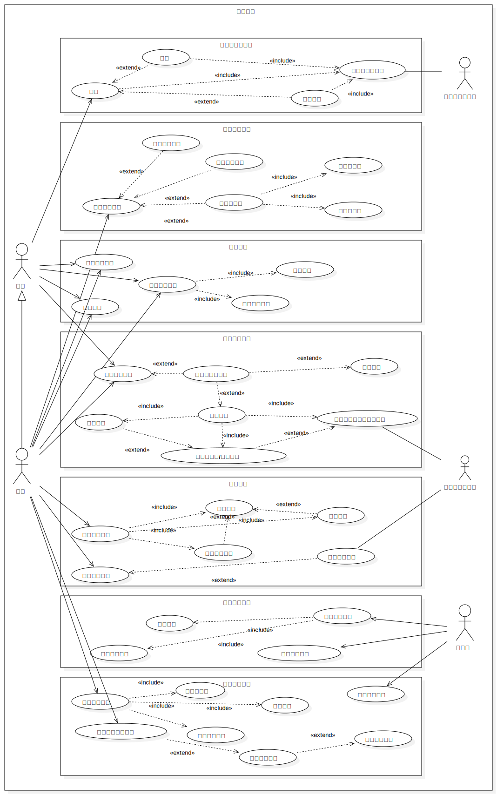
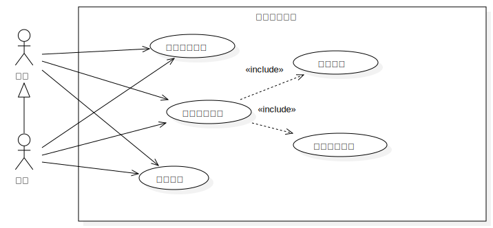

# 修订历史

| 编写日期  | SEPG | 版本   | 说明                                                         | 作者                         |
| --------- | ---- | ------ | ------------------------------------------------------------ | ---------------------------- |
| 2022.11.4 |      | v0.0.1 | 完成项目介绍与需求分析                                       | 陈元哲，方仪，白珂睿，高骏骋 |
| 2022.11.6 |      | v0.0.2 | 完成功能性需求设计                                           | 陈元哲，方仪，白珂睿，高骏骋 |
| 2022.11.7 |      | v0.0.3 | 补充用例详情，列出开发中可能会使用的接口，完成了非功能性需求与其他需求 | 陈元哲，方仪，白珂睿，高骏骋 |
| 2022.11.8 |      | v0.0.4 | 完善用例详情与需求分析                                       | 陈元哲，方仪，白珂睿，高骏骋 |

# 目录

[TOC]

# 1 介绍

随着经济的发展与人们生活水平的提高，线下演出，现场体验是越来越受欢迎的娱乐方式。演出作为文化产业的终端输出方式，涉及娱乐、音乐、电影、体育、游戏等创意文化产业。票务是线下演艺行业对消费者的“门面”，是消费者对文化内容消费的第一步，对形成良好的消费体验直观重要。近年来互联网技术的发展，让更多人选择线上购票的方式。我们希望以此为契机，打造一个由票务链接的演艺生态圈，让用户获得更好的票务消费体验，瞄准用户痛点，创造一个更好的互联网票务环境。

本项目包括用户、平台管理员两个个主体。核心功能为平台与用户之间的票务交易，我们引入了与票务产品互相绑定的现场分享功能，既是用户对演出美好瞬间的记录也是对演出的评价与反馈。针对传统购票平台出现的黄牛倒卖导致的购票难、用户个人原因无法参与演出而导致的转卖难等问题，我们做出功能性的优化，充分保障消费者的权益。为了维护良好的社区氛围，我们引入了管理员角色，为演出的举办以及用户发布的分享等信息进行审核，保障一个健康的互联网交流环境。

项目的名称为“一排一座”，指的是剧场中第一排离演员最近的位置，通常是预留给演员们的赠票以邀请对他们而言重要的客人。每一位用户都是我们珍视的对象，我们希望我们的服务能带给我们的用户一排一座的体验。

# 2 整体描述

# 3 系统与其他系统的接口

主要在以下几个场景中需要用到系统外部接口：

-  用户进行注册时需要使用到图片验证码生成的功能；

-  为了确保用户信息的真实性与可靠性，我们需要对用户信息进行验证。这将用到手机号实名认证与身份证实名认证的外部接口；

-  用户确认订单后需进行支付，这将用到生成付款二维码的外部接口。

## 3.1 图片验证码生成接口

请求参数：

* 

## 3.2 手机号实名认证

请求参数：

* 

## 3.3 身份证实名认证

请求参数：

* 

## 3.4 二维码生成

请求参数：

* 

# 4 需求调研

因疫情原因等限制，我们采用了线上调查问卷的方式开展项目的需求调研，我们将问卷发布主要到了微信朋友圈，共收集了68份有效问卷，并对需求做出了总结。

我们共制定了十道题目，问题如下：

- 您的所在城市是

- 您的年龄是

- 您观看线下演出（电影，戏剧，体育比赛，演唱会，livehouse等）的频次是（非疫情时期）

- 请您将以下用户痛点排序（对您影响较大的在前）

- 您买过黄牛票吗

- 您购买的黄牛票存在溢价吗

- 您对黄牛的态度是

- 您遇到过购票后因个人或不可抗力无法观看的情况吗

- 您是如何处理无法观看的门票的

- 您希望购票平台出现哪些新功能

针对收集到的问题，我们依次进行了调研分析，寻找用户的主要需求等

（1）您的所在城市是

本题可能一定程度上有一定的偏差，主要基于学校所在地等因素，但仍不难看出我们的受众更多分布在经济较为发达地区，例如浙江三名用户所在地都来自于杭州

基于此，我们的“一排一座”购票平台将按地区，更多的进行一二线城市演出的曝光和售票，满足广大用户的需求。

（2）您的年龄是

受众用户主要是大学生、研究生等年轻人，也有中老年人的参与，因此我们提供的票务服务应该多种多样，在满足大部分青年群体需求的同时，也要服务于不同年龄层次的用户。

（3）您观看线下演出（电影，戏剧，体育比赛，演唱会，livehouse等）的频次是（非疫情时期）

大多数用户都保持一年2-5次观演频率，更有超过33%的用户评价每月就要观演1次以上，可以看出项目有较大的发展潜力和用户基础。

（4）请您将以下用户痛点排序（对您影响较大的在前）

超过69%的受访者都将抢票困难放在了第一位，紧随其后的是宣传信息的缺失、用户交流和转卖困难等。根据受访者的反馈，我们应该在这方面满足用户需求，如开放用户专卖，设置用户交流论坛，将演出信息及时公布等，最大可能满足用户痛点需求。

（5）您买过黄牛票吗？

“黄牛票”即黄牛票是指一些人有组织先大量购入热门赛事或很受欢迎之公开表演进场门票，及后在非官方的[途径]()，以更高价格向其他想参与但却不能从合法途径购到票的观众售出黄牛票，从中赚取差价图利。因形势不同，现在的某些黄牛票也有不溢价或低于市场价的情况。

本题调查结果显示，有30.88%的观众购买过黄牛票，69.12%的观众没有购买过黄牛票。虽然占少数，但观众中还是有一定基数的人群曾经购买过黄牛票的。可以看出，这是购票困难中值得解决的一个。

 

（6）您购买的黄牛票存在溢价吗？

本题在买过黄牛票的人中，对溢价程度进行了调查。其中14.29%的购票没有溢价，14.29%的购票溢价在10%以下，42.86%的购票溢价在10%-50%，23.81%的购票溢价在50%-100%，4.76%的购票溢价在100%以上。调查结果说明，黄牛票普遍存在溢价现象，并大多溢价为10%-50%，但仍存在超过100%的高溢价现象。

 

（7）您对黄牛的态度是？

本题调查结果显示，有4.76%的人认为黄牛合情合理，提供了更多购票的渠道，有47.62%的人认为黄牛应该被取缔，增加了购票的难度，有47.62%的人认为应该顺其自然，事物存在就有其一定的道理。对黄牛持反对态度的人和中立态度的人占比相似，且几乎各占一半。

 

5、6、7题对黄牛的现象进行了调查。综合以上3题的结果，不难发现，黄牛现象还是存在于购票环节中的，并且给观众造成了一定的不便，但其中半数人持中立态度。针对这一现象，一排一座平台希望设置相应的机制，对黄牛倒卖票的行为进行制约，并通过转卖系统来改善黄牛票对非官方票务买卖市场的恶性影响。

 

（8）您遇到过购票后因个人或不可抗力无法观看的情况吗？

本题调查结果显示，有70.59%的人都遇到过题述情况，29.41%的人没遇到过类似情况。说明购票后无法观看的情况是普遍存在的。

（9）您是如何处理无法观看的门票的？

本题调查结果显示，处理方式中，演出取消，商家退款占33.33%，赠予他人占10.42%，以购票时相同价格转卖占12.5%，以购票时小幅降低价格转卖占31.25%，以购票时大幅降低价格转卖占2.08%，以购票时更高价格转卖占0%，没有处理，损失全额票价占10.42%。分析结果可知，以转卖方式处理无法观看的票的人总数近半，并大多为小幅度降价转出。

综合8、9题的调查结果，受访者由于各类原因无法观看的情况时常发生。为减少用户损失，同时也降低转卖时需要花费的时间和精力成本，本平台增加票务转卖功能，提供用户已购票的便捷转卖服务，将转卖与演出信息直接关联，并对价格区间进行合理控制。

（10）您希望购票平台出现哪些新功能

根据对于问卷的分析，我们可以看到大部分的受访者都认为当前的平台应提供退票或转卖票的服务，尤其是在疫情环境下，可能会时有因各种原因不能到场的情况，需减小用户的损失，这也是我们平台要实现的特色，增加票务转卖功能。

# 5 功能性需求描述

## 5.1 总用例图

## 5.2 注册登录系统

在注册登录系统中，主要应当完成以下功能需求：

1. 游客可以通过填写手机号码等信息，注册成为票务平台用户
2. 游客可以通过手机号登录为用户
3. 对于系统赋予权限的管理员账号，也可以通过用户名和密码进行登录

### 5.2.1 注册用例分析

| 用例              | 注册                                                         |
| ----------------- | :----------------------------------------------------------- |
| ID                | UC01                                                         |
| Specification     | 游客填写基本信息并注册为用户                                 |
| Actors            | 游客                                                         |
| Pre-condition     | 游客打开票务平台，进入注册页面                               |
| Flow of Events    | 1. 游客进入注册页面，以下情况会导致游客进入注册页面   1.1 游客点击页面中“注册”按钮   1.2 游客进行了需要登录用户才能执行的权限操作，进入了登录界面，经过系统指引后进入注册界面 2. 用户填写基本注册信息: &nbsp;&nbsp;2.1 用户填写手机号码并选择自己的常驻城市 &nbsp;&nbsp;2.2 用户设置昵称与密码 3. 系统验证用户填写的手机号格式是否正确以及手机号是否被注册 4. 用户点击“发送验证码”按钮，之后填写从手机短信上获得的验证码 5. 系统验证并记录用户的信息，返回状态信息 6. 注册用例结束 |
| Alternative Flows | 1. 用户可在注册的任何阶段关闭/退出页面 2. 用户在注册时可能会出现的错误 &nbsp;&nbsp;2.1 用户输入错误的手机号 &nbsp;&nbsp;&nbsp;&nbsp;&nbsp;&nbsp;&nbsp;&nbsp;&nbsp;系统将会提示“错误的手机号”并返回注册页面 &nbsp;&nbsp;2.2 用户输入已注册的手机号 &nbsp;&nbsp;&nbsp;&nbsp;&nbsp;&nbsp;&nbsp;&nbsp;&nbsp;系统将会提示“改手机号已注册”并返回注册页面 &nbsp;&nbsp;2.3 用户未收到验证码 &nbsp;&nbsp;&nbsp;&nbsp;&nbsp;&nbsp;&nbsp;&nbsp;&nbsp;系统允许用户在30s后重新发送一次验证码 &nbsp;&nbsp;2.4 用户输入了错误的验证码 &nbsp;&nbsp;&nbsp;&nbsp;&nbsp;&nbsp;&nbsp;&nbsp;&nbsp;系统提示“错误的验证码”，之后用户可以重新输入验证码 |
| Post-condition    | 用户获得了一个账户，并成为已注册用户。                       |

### 5.2.2 登录用例分析

|用例|登录|
|---|:---|
|ID|UC02|
|Specification|游客输入手机号与密码\手机号与短信认证登录账户|
|Actors|游客|
|Pre-condition|游客打开票务平台，进入登录页面|
|Flow of Events|1. 游客进入登录界面，以下情况会导致游客进入登录界面   1.1 游客点击页面中“登录”按钮   1.2 游客进行了需要登录用户才能执行的权限操作 2. 用户可选择登录方式，使用手机号与密码登录以及使用手机号短信认证登录，默认为使用手机号与密码登录   2.1 选择手机号与密码登录，用户填写手机号与密码   2.2 选择手机号与短信验证登录，用户填写手机号后点击“发送验证码”按钮 3. 用户点击“登录”按钮，系统对用户输入信息进行验证，返回状态信息 4. 用户根据登录状态决定下一步操作 5. 登录用例结束|
|Alternative Flows|1. 用户可在登录的任何阶段关闭/退出页面  2. 用户输入错误的账户信息 &nbsp;&nbsp;2.1 用户输入了无效的手机号 &nbsp;&nbsp;&nbsp;&nbsp;&nbsp;&nbsp;&nbsp;&nbsp;&nbsp;系统拒绝登录，并提示"不存在的账户" &nbsp;&nbsp;2.2 用户输入错误的密码 &nbsp;&nbsp;&nbsp;&nbsp;&nbsp;&nbsp;&nbsp;&nbsp;&nbsp;系统拒绝登录，并提示"错误的密码" &nbsp;&nbsp;2.3 用户输入三次错误的密码后 &nbsp;&nbsp;&nbsp;&nbsp;&nbsp;&nbsp;&nbsp;&nbsp;&nbsp;系统登录时要求用户输入图片验证码 3. 用户点击”忘记密码“按钮 &nbsp;&nbsp;&nbsp;&nbsp;&nbsp;&nbsp;&nbsp;&nbsp;&nbsp;用户进入找回密码流程|
|Post-condition|游客身份转换为已登录用户|

### 5.2.3 找回密码用例分析

| 用例              | 找回密码                                                     |
| ----------------- | :------------------------------------------------------------ |
| ID                | UC03                                                         |
| Specification     | 游客忘记了自己的账号密码，重设密码                           |
| Actors            | 游客                                                         |
| Pre-condition     | 游客拥有一个已注册的账户                                     |
| Flow of Events    | 1. 游客进入网站，点击“找回密码”按钮 2. 用户输入手机号，点击“发送验证码”按钮 3. 第三方平台验证信息，若验证码正确可进行下一步操作 4. 用户输入新密码，并进行二次确认 5. 找回密码用例结束 |
| Alternative Flows | 1. 用户可在找回密码的任何阶段关闭/退出页面 2. 用户输入错误的账户信息 &nbsp;&nbsp;1.1 用户输入了无效的手机号 &nbsp;&nbsp;&nbsp;&nbsp;&nbsp;&nbsp;&nbsp;&nbsp;&nbsp;系统拒绝验证，并提示"不存在的账户" &nbsp;&nbsp;1.2 用户在二次确认时输入错误的密码 &nbsp;&nbsp;&nbsp;&nbsp;&nbsp;&nbsp;&nbsp;&nbsp;&nbsp;系统拒绝密码找回，并提示"错误的密码"  |
| Post-condition    | 用户重设了账户密码，游客身份转换为已登录用户                 |

### 5.2.4 短信验证码验证用例分析

| 用例              | 短信验证码验证                                               |
| ----------------- | :------------------------------------------------------------ |
| ID                | UC04                                                         |
| Specification     | 在注册、登录、找回密码时，用户需要SMS短信安全认证            |
| Actors            | 游客                                                         |
| Pre-condition     | 游客在所处的注册、登录、找回密码界面进行短信认证             |
| Flow of Events    | 1. 用户按照提示输入手机号，点击“发送验证码”按钮 2. 系统检查用户输入手机格式，若格式正确且符合其它前置条件，则向第三方认证平台接口发送用户手机号 3. 第三方平台向用户手机发送验证码短信 4. 用户填写收到的验证码，并点击“确认”按钮 5. 短信验证码验证用例结束 |
| Alternative Flows | 1. 用户可在短信验证码验证的任何阶段关闭/退出页面 2. 验证过程出现异常 &nbsp;&nbsp;1.1 用户输入了无效的手机号 &nbsp;&nbsp;&nbsp;&nbsp;&nbsp;&nbsp;&nbsp;&nbsp;&nbsp;系统拒绝验证，并提示"不存在的账户" &nbsp;&nbsp;1.2 用户在二次确认时输入错误的密码 &nbsp;&nbsp;&nbsp;&nbsp;&nbsp;&nbsp;&nbsp;&nbsp;&nbsp;系统拒绝密码找回，并提示"错误的密码"   1.3 用户未收到验证码 &nbsp;&nbsp;&nbsp;&nbsp;&nbsp;&nbsp;&nbsp;&nbsp;&nbsp;系统允许用户在30s后重新发送一次验证码 &nbsp;&nbsp;1.4 用户输入了错误的验证码 &nbsp;&nbsp;&nbsp;&nbsp;&nbsp;&nbsp;&nbsp;&nbsp;&nbsp;系统提示“错误的验证码”，之后用户可以重新输入验证码或等待30s后重新发送验证码  |
| Post-condition    | 用户经验证后被赋予了相关操作权限                             |

## 5.3 用户信息系统

在用户信息系统中，应该满足以下需求：

1. 用户在任意界面可以通过导航栏进入到个人信息界面，查看个人信息。

2. 用户在个人信息界面可以修改自己的用户名、头像和个性签名。

3. 用户在个人信息界面可以查看到自己所有的订单，包括已完成及未完成的订单。

4. 用户可以增删购票人。

### 5.3.1 查看用户信息用例分析

| 用例              | 查看用户信息                                                 |
| ----------------- | :----------------------------------------------------------- |
| ID                | UC05                                                         |
| Specification     | 用户进入个人信息界面后可查看个人信息                         |
| Actors            | 用户                                                         |
| Pre-condition     | 用户点击进入个人信息界面                                     |
| Flow of Events    | 1. 用户在任意界面点击头像，进入个人信息界面 2. 将会显示用户名、账号、头像等信息 3. 查看用户信息用例结束 |
| Alternative Flows | 1. 用户可在查看用户信息的任何阶段关闭/退出页面 2. 用户在查看用户信息时可能会出现的错误 &nbsp;&nbsp;2.1 网络错误/信息加载错误 &nbsp;&nbsp;&nbsp;&nbsp;&nbsp;&nbsp;&nbsp;&nbsp;&nbsp;系统将会提示“页面加载失败”  |
| Post-condition    | 无                                                           |

### 5.3.2 修改用户信息用例分析

| 用例              | 修改用户信息                                                 |
| ----------------- | :----------------------------------------------------------- |
| ID                | UC06                                                         |
| Specification     | 用户进入个人信息界面后可修改个人信息                         |
| Actors            | 用户                                                         |
| Pre-condition     | 用户在个人信息界面点击“修改”按钮                             |
| Flow of Events    | 1. 用户在个人信息界面点击“修改”按钮，进入信息修改界面 2. 用户选择修改用户名、头像或个性签名 3. 用户输入新的用户名、头像或个性签名 4. 系统检测新的个人信息是否符合规范并返回相应结果 5. 修改用户信息用例结束 |
| Alternative Flows | 1. 用户可在修改用户信息的任何阶段关闭/退出页面 2. 用户在修改用户信息时可能会出现的错误 &nbsp;&nbsp;2.1 网络错误/信息加载错误 &nbsp;&nbsp;&nbsp;&nbsp;&nbsp;&nbsp;&nbsp;&nbsp;&nbsp;系统将会提示“页面加载失败” &nbsp;&nbsp;2.2 系统检测到新的个人信息不符合规范 &nbsp;&nbsp;&nbsp;&nbsp;&nbsp;&nbsp;&nbsp;&nbsp;&nbsp;系统将会提示“用户信息修改失败”并返回个人信息界面 |
| Post-condition    | 无                                                           |

### 5.3.3 查看我的订单用例分析

| 用例              | 查看我的订单                                                 |
| ----------------- | :----------------------------------------------------------- |
| ID                | UC07                                                         |
| Specification     | 用户在个人信息界面可跳转至我的订单界面，查看到自己所有的订单信息 |
| Actors            | 用户                                                         |
| Pre-condition     | 用户已经登录。游客状态无法查看我的订单                       |
| Flow of Events    | 1. 用户在个人信息界面点击“我的订单”，进入订单信息界面 2. 用户在该界面查看到自己所有未完成、已完成订单的所有信息 3. 查看我的订单用例结束 |
| Alternative Flows | 1. 用户可在查看我的订单的任何阶段关闭/退出页面 2. 用户在查看我的订单时可能会出现的错误 &nbsp;&nbsp;2.1 网络错误/信息加载错误 &nbsp;&nbsp;&nbsp;&nbsp;&nbsp;&nbsp;&nbsp;&nbsp;&nbsp;系统将会提示“页面加载失败”  |
| Post-condition    | 无                                                           |

### 5.3.4 增添购票人用例分析

| 用例              | 增添购票人                                                   |
| ----------------- | :----------------------------------------------------------- |
| ID                | UC08                                                         |
| Specification     | 用户通过个人信息界面进入购票人界面，可增添购票人             |
| Actors            | 用户                                                         |
| Pre-condition     | 用户在购票人界面增添购票人                                   |
| Flow of Events    | 1. 用户登录并进入购票人界面，点击“+”号以增添购票人 2. 用户填写购票人真实姓名、身份证号以及手机号 3. 用户点击“确认增添”，系统核实新增购票人身份信息并返回相应结果 4. 增添购票人用例结束 |
| Alternative Flows | 1. 用户可在增添购票人的任何阶段关闭/退出页面 2. 用户在增添购票人时可能会出现的错误 &nbsp;&nbsp;2.1 网络错误/信息加载错误 &nbsp;&nbsp;&nbsp;&nbsp;&nbsp;&nbsp;&nbsp;&nbsp;&nbsp;系统将会提示“演出详情加载失败”并返回主页面 &nbsp;&nbsp;2.2 购票人实名信息核验不通过 &nbsp;&nbsp;&nbsp;&nbsp;&nbsp;&nbsp;&nbsp;&nbsp;&nbsp;系统将会提示“实名认证失败”并提示用户重新输入购票人信息  |
| Post-condition    | 无                                                           |

### 5.3.5 删除购票人用例分析

| 用例              | 删除购票人                                                   |
| ----------------- | :----------------------------------------------------------- |
| ID                | UC09                                                         |
| Specification     | 用户通过个人信息界面进入购票人界面，可删除购票人             |
| Actors            | 用户                                                         |
| Pre-condition     | 用户至少有一名除自己以外的购票人                             |
| Flow of Events    | 1. 用户登录并进入购票人界面，点击一个购票人信息后的“删除”按钮 2. 用户点击“确认删除” 3. 删除购票人用例结束 |
| Alternative Flows | 1. 用户可在删除购票人的任何阶段关闭/退出页面 2. 用户在删除购票人时可能会出现的错误 &nbsp;&nbsp;2.1 网络错误/信息加载错误 &nbsp;&nbsp;&nbsp;&nbsp;&nbsp;&nbsp;&nbsp;&nbsp;&nbsp;系统将会提示“演出详情加载失败”并返回主页面  |
| Post-condition    | 无                                                           |

## 5.4 票务查询系统

## 5.5 票务信息系统

在票务信息系统中，主要应当完成以下功能需求：

1. 游客和用户可以浏览查看感兴趣的演出的详情，包括其时间、地点、票价、场次、详细介绍、图片等信息。

2. 用户可以查看演出的场次与票档，选择后可以看当前已选择的对应场次与票档是否有余票，如果有可以发起创建订单。

3. 用户可以随时取消选择的场次和票档。

4. 用户进行订单创建，可以选择座位、支付方式、观演人信息等多种信息，并可以在每一步取消订单创建。

5. 用户可以阅读《订票协议》，如同意协议则可提交订单，等待平台审批。

### 5.5.1 选择场次与票档用例分析

| 用例              | 选择场次与票档                                               |
| ----------------- | :----------------------------------------------------------- |
| ID                | UC                                                           |
| Specification     | 用户在演出详情页可以点击选择自己心仪的演出的场次和票档       |
| Actors            | 用户                                                         |
| Pre-condition     | 游客点击后进行登录才能继续选择；用户可在演出详情页直接选择   |
| Flow of Events    | 1. 用户查看详情页，选择自己喜欢的场次和票档 2. 用户分别点击场次和票档的按钮进行选择 3. 用户提交选择继续进行后续订单操作，或取消选择  |
| Alternative Flows | 1. 用户可在选择场次与票档的任何阶段关闭/退出页面 2. 用户在选择场次与票档时可能会出现的错误 &nbsp;&nbsp;2.1 用户选择的场次票档已无余票 &nbsp;&nbsp;&nbsp;&nbsp;&nbsp;&nbsp;&nbsp;&nbsp;&nbsp;系统将会提示“该场次下该票档已无余票”并返回详情页面  |
| Post-condition    | 无                                                           |

### 5.5.2 创建订单用例分析

| 用例              | 创建订单                                                     |
| ----------------- | :----------------------------------------------------------- |
| ID                | UC                                                           |
| Specification     | 用户在选择好场次和票档后进入订单创建步骤，经过选座、选观演人、配送方式、支付方式后，同意订票协议并提交订单完成订单的创建 |
| ctors             | 用户                                                         |
| Pre-condition     | 用户完成场次和票档的选择                                     |
| Flow of Events    | 1. 用户进入选座界面 2. 用户点击想选择的座位，会显示点击座位的位置和价格，点击确定按钮确定座位 3. 用户确定座位后跳转确认其他信息的界面: &nbsp;&nbsp;3.1 用户选择观演人（个人信息中已添加的观演人），将显示观演人姓名和手机号 &nbsp;&nbsp;3.2 用户选择配送方式 &nbsp;3.3 用户选择支付方式并支付 4. 用户点击订票协议可以查看协议，勾选后可以点击提交订单按钮提交订单，订单会生成并提交给系统  |
| Alternative Flows | 1. 用户可在创建订单的任何阶段关闭/退出页面 2. 用户在创建订单时可能会出现的错误 &nbsp;&nbsp;2.1 网络错误/信息加载错误 &nbsp;&nbsp;&nbsp;&nbsp;&nbsp;&nbsp;&nbsp;&nbsp;&nbsp;系统将会提示“演出详情加载失败”并返回主页面 &nbsp;&nbsp;2.2 用户选择已被选定的座位后点击“确定” &nbsp;&nbsp;&nbsp;&nbsp;&nbsp;&nbsp;&nbsp;&nbsp;&nbsp;系统将会提示“该座位已被预订” &nbsp;&nbsp;2.3 用户未勾选“已阅读订票协议”就提交订单 &nbsp;&nbsp;&nbsp;&nbsp;&nbsp;&nbsp;&nbsp;&nbsp;&nbsp;系统会提示用户“请先阅读《订票协议》” &nbsp;&nbsp; |
| Post-condition    | 订单交由管理员审核，审核通过后将显示在个人中心-我的订单中    |

### 5.5.3 查看演出详情用例分析

| 用例              | 查看演出详情                                                 |
| ----------------- | :----------------------------------------------------------- |
| ID                | UC                                                           |
| Specification     | 游客和用户点击感兴趣演出，浏览并查看其详细信息               |
| Actors            | 游客，用户                                                   |
| Pre-condition     | 用户在首页浏览首页演出或搜索演出信息                         |
| Flow of Events    | 1. 用户点击感兴趣的演出，进入其详情单 2. 将会显示演出的详细信息，包括时间、地点、参演者、剧照等，以及场次和票价  |
| Alternative Flows | 1. 用户可在查看演出详情的任何阶段关闭/退出页面 2. 用户在查看演出详情时可能会出现的错误 &nbsp;&nbsp;2.1 网络错误/信息加载错误 &nbsp;&nbsp;&nbsp;&nbsp;&nbsp;&nbsp;&nbsp;&nbsp;&nbsp;系统将会提示“演出详情加载失败”并返回主页面 3.用户在此页面进行场次和票档的选择 |
| Post-condition    | 无                                                           |

## 5.6 转卖系统

在转卖系统中，应该满足以下的需求：

1. 对于用户已购买的、还在期限内的未入场有效票卷，由于票务的特殊性，不能像其他商品进行直接退款，应该提供用户转卖的平台。
2. 对于一场演出，购票用户可以获得其他用户的转卖信息，用户能够购买转卖票。
3. 用户可以管理自己的转卖信息，当票还未卖出时，能够撤销自己的转卖信息。
4. 对于通过转卖方式购买的票卷，禁止二次转卖
5. 转卖功能仅为用户提供购票后因个人原因缺席的便利，减小用户购票的门槛，用户需同意《一座一排平台票务转卖守则》才能进行转卖。

### 5.6.1 创建转卖用例分析

| 用例              | 创建转卖                                                     |
| ----------------- | :----------------------------------------------------------- |
| ID                | UC                                                           |
| Specification     | 用户将已购买的、还在期限内的未出场有效票卷放入转卖平台进行转卖 |
| Actors            | 用户                                                         |
| Pre-condition     | 用户拥有一个已购买的、还在期限内的未出场有效票卷订单         |
| Flow of Events    | 1. 用户进入个人中心页面，进入“我的订单”页面，在符合条件的订单卡片中，用户点击“一键转卖”按钮 2. 用户设置转卖的价格/截至兑换期限(转卖的最晚有效时间，在演出开始之前) 3. 用户阅读《一座一排平台票务转卖守则》并勾选同意后，转卖生效 4. 创建转卖用例结束 |
| Alternative Flows | 1. 用户可在创建转卖用例的任何阶段关闭/退出页面 2. 用户在票务转卖时可能会出现的错误 &nbsp;&nbsp;2.1 网络错误/信息加载错误 &nbsp;&nbsp;&nbsp;&nbsp;&nbsp;&nbsp;&nbsp;&nbsp;&nbsp;系统将会提示“加载失败”并返回主页面   2.2 创建转卖时间过晚          为保证转卖系统的正常运行，系统会设置在演出开始前的最晚转卖时间，超过此时间后，订单卡片中不会出现“一键转卖”按钮。并且未生效的转卖也将出现提示信息并作废 3. 用户没有勾选转卖守则的同意，弹出提示信息，转卖不予生效 |
| Post-condition    | 无                                                           |

### 5.6.2 管理转卖信息用例分析

| 用例              | 管理转卖信息                                                 |
| ----------------- | :----------------------------------------------------------- |
| ID                | UC                                                           |
| Specification     | 用户管理自身已生效的转卖信息，可修改或删除转卖信息           |
| Actors            | 用户                                                         |
| Pre-condition     | 用户拥有已生效的转卖信息                                     |
| Flow of Events    | 1. 用户进入个人中心页面，进入“我的转卖”页面 2. 用户点击需要管理的转卖卡片 3. 用户可更改转卖的价格以及截至兑换期限，也可以删除转卖 4. 用户更改结束后点击“保存更改”按键，系统返回更改结果 5. 管理转卖信息用例完成 |
| Alternative Flows | 1. 用户可在管理转卖信息的任何阶段关闭/退出页面 2. 用户在管理转卖信息时可能会出现的错误 &nbsp;&nbsp;2.1 网络错误/信息加载错误 &nbsp;&nbsp;&nbsp;&nbsp;&nbsp;&nbsp;&nbsp;&nbsp;&nbsp;系统将会提示“加载失败”并返回主页面   2.2 转卖信息保存失败          用户将返回转卖信息编辑界面，系统提示“网络错误，请重新提交”  |
| Post-condition    | 无                                                           |

### 5.6.3 浏览转卖信息用例分析

| 用例              | 浏览转卖信息                                                 |
| ----------------- | :----------------------------------------------------------- |
| ID                | UC                                                           |
| Specification     | 用户可以在浏览演出票务信息时可以浏览对应的用户发布的转卖信息 |
| Actors            | 用户                                                         |
| Pre-condition     | 用户已登录，游客无法查看转卖信息                             |
| Flow of Events    | 1. 用户进入售票平台，进入到演出详情页面 2. 用户可在该页面查看系统推荐的转卖信息 3. 用户可点击“更多”按钮查看有关演出的所有转卖信息 4. 用户可按场次/票档/票价等信息筛选转卖信息  |
| Alternative Flows | 1. 用户可在浏览转卖信息的任何阶段关闭/退出页面 2. 用户在管理转卖信息时可能会出现的错误 &nbsp;&nbsp;2.1 网络错误/信息加载错误 &nbsp;&nbsp;&nbsp;&nbsp;&nbsp;&nbsp;&nbsp;&nbsp;&nbsp;系统将会提示“加载失败”并返回主页面   2.2 转卖截至时间已到          此时所有有关演出的转卖信息将失效，不会显示任何转卖信息 3. 用户可以点击任意转卖信息进入转卖详情界面，并进行购买操作 |
| Post-condition    | 无                                                           |

### 5.6.4 购买转卖票卷用例分析

| 用例              | 购买转卖票卷                                                 |
| ----------------- | :----------------------------------------------------------- |
| ID                | UC                                                           |
| Specification     | 用户在浏览转卖信息后可以购买转卖票卷                         |
| Actors            | 用户                                                         |
| Pre-condition     | 用户进入了转卖信息页面                                       |
| Flow of Events    | 1. 用户进入售票平台，进入转卖信息页面，点击“购买” 2. 用户用户阅读《一座一排平台票务转卖守则》并勾选同意后进入第三方平台支付页面 3. 用户在第三方平台支付成功后，系统执行转卖交易操作 4. 购买转卖票卷用例结束  |
| Alternative Flows | 1. 用户可在购买转卖票卷的任何阶段关闭/退出页面 2. 用户在购买转卖票卷时可能会出现的错误 &nbsp;&nbsp;2.1 网络错误/信息加载错误 &nbsp;&nbsp;&nbsp;&nbsp;&nbsp;&nbsp;&nbsp;&nbsp;&nbsp;系统将会提示“加载失败”并返回主页面   2.2 转卖截至时间已到          此时所有有关演出的转卖信息将失效，点击“购买”不会进行购买动作，强制刷新页面   2.3 用户支付失败          此时转卖状态恢复，页面回到转卖信息页面  |
| Post-condition    | 卖出者在“我的转卖”中可看到自己的转卖情况为“售出”，买入者在“我的订单”中可以看到购入的订单。 |

## 5.7 票务管理系统

在票务管理系统中，应满足以下需求：

1. 管理员可以在票务管理平台对所有的票务信息进行管理；

2. 管理员能够查看所有票务信息的售票情况；

3. 管理员可以在票务管理平台上架演出，但需将演出详细信息、时间、地点、票价填写完整并勾选相关协议。演出一旦发布，无特殊情况不可随意删除；

4. 管理员可以修改演出信息。

5. 上架后的演出在结束后将由平台自动下架，无需管理员操作。

### 5.7.1 上架演出用例分析

| 用例              | 上架演出                                                     |
| ----------------- | :----------------------------------------------------------- |
| ID                | UC                                                           |
| Specification     | 管理员将演出详细信息、时间、票价等填写完整并勾选相关协议后上架该场演出 |
| Actors            | 管理员                                                       |
| Pre-condition     | 操作者拥有管理员权限                                         |
| Flow of Events    | 1. 管理员登录并进入票务管理平台，进入到上架演出界面 2. 管理员填写演出地点、时间、演出剧照、参演人员名单、演出简介、各档次座位票价并勾选《一排一座演出发布协议》 3. 管理员点击“发布演出”按钮，系统检查信息完整度与合法性并返回发布结果 4. 上架演出用例结束 |
| Alternative Flows | 1. 管理员可在填写演出信息的任何阶段关闭/退出页面 2. 管理员在发布演出时可能会出现的错误 &nbsp;&nbsp;2.1 网络错误/信息加载错误 &nbsp;&nbsp;&nbsp;&nbsp;&nbsp;&nbsp;&nbsp;&nbsp;&nbsp;系统将会提示“页面加载失败” &nbsp;&nbsp;2.2 演出信息未填写完整 &nbsp;&nbsp;&nbsp;&nbsp;&nbsp;&nbsp;&nbsp;&nbsp;&nbsp;系统将会提示管理员补全对应信息 &nbsp;&nbsp;2.3 管理员未勾选“已阅读《一排一座演出发布协议》”就发布演出 &nbsp;&nbsp;&nbsp;&nbsp;&nbsp;&nbsp;&nbsp;&nbsp;&nbsp;系统会提示管理员“请勾选已阅读《一排一座演出发布协议》”  |
| Post-condition    | 无                                                           |

### 5.7.2 修改演出信息用例分析

| 用例              | 修改演出信息                                                 |
| ----------------- | :----------------------------------------------------------- |
| ID                | UC                                                           |
| Specification     | 在演出开始前管理员可进入演出信息修改界面修改演出有关信息     |
| Actors            | 管理员                                                       |
| Pre-condition     | 操作者拥有管理员权限且要更改的该场演出尚未开始               |
| Flow of Events    | 1. 管理员登录并进入票务管理平台，进入到修改演出信息界面 2. 管理员浏览旧版本的演出地点、时间、演出剧照、参演人员名单、演出简介、各档次座位票价并在原有基础上进行更改 3. 管理员点击“确认更改”按钮，系统检查信息完整度与合法性并返回结果 4. 修改演出信息用例结束 |
| Alternative Flows | 1. 管理员可在修改演出信息的任何阶段关闭/退出页面 2. 管理员在修改演出信息时可能会出现的错误 &nbsp;&nbsp;2.1 网络错误/信息加载错误 &nbsp;&nbsp;&nbsp;&nbsp;&nbsp;&nbsp;&nbsp;&nbsp;&nbsp;系统将会提示“页面加载失败” &nbsp;&nbsp;2.2 修改后的演出信息不完整或不符合要求 &nbsp;&nbsp;&nbsp;&nbsp;&nbsp;&nbsp;&nbsp;&nbsp;&nbsp;系统将会提示管理员重新修改演出信息 &nbsp;&nbsp;2.3 演出已开始，处于不可修改状态 &nbsp;&nbsp;&nbsp;&nbsp;&nbsp;&nbsp;&nbsp;&nbsp;&nbsp;系统将提示“演出信息当前不可修改”  |
| Post-condition    | 无                                                           |

### 5.7.3 查看售票情况用例分析

| 用例              | 查看售票情况                                                 |
| ----------------- | :----------------------------------------------------------- |
| ID                | UC                                                           |
| Specification     | 管理员可查看某场演出总售票量、售票时间线以及总交易额         |
| Actors            | 管理员                                                       |
| Pre-condition     | 操作者拥有管理员权限                                         |
| Flow of Events    | 1. 管理员登录并进入票务管理平台，通过演出详情界面进入到售票信息界面 2. 管理员在该界面查看该场演出总售票量、售票时间线以及总交易额 3. 管理员选择柱状图或折线图的方式来查看售票情况 4. 查看售票情况用例结束 |
| Alternative Flows | 1. 管理员可在查看售票情况的任何阶段关闭/退出页面 2. 管理员在查看售票情况时可能会出现的错误 &nbsp;&nbsp;2.1 网络错误/信息加载错误 &nbsp;&nbsp;&nbsp;&nbsp;&nbsp;&nbsp;&nbsp;&nbsp;&nbsp;系统将会提示“演出详情加载失败”并返回主页面  |
| Post-condition    | 无                                                           |

## 5.8 现场分享系统

# 6 非功能性需求描述

除功能性需求外，本平台在使用过程中也需要具有非功能性需求，包括安全性需求、可靠性需求、互操作性需求等。

## 6.1 安全性需求

对于“一排一座”票务平台的安全性需求而言，我们主要考虑了保密性、可靠性和完整性三个子特性。

对于保密性，民宿平台需要构建完善的鉴权机制以实现数据不能被授权用户以外的任何人访问的能力。未登录的用户和已登录的用户看到的页面信息是不同的；用户查看其他用户的信息范围也应是不同的。而对于用户输入的包括手机号、密码等信息也应使用完善的加密机制以安全无法被访问的形式存储于数据库中。各种信息的安全性需求初步分析如下：

所有用户的个人基本信息（头像、昵称等），信息公开，授权人员可以更新；

所有用户的私密性性信息（手机号等），信息保密，数据库人员维护更新；

票务信息，由管理员进行维护，信息公开；

论坛发布信息，由所属用户进行维护，信息公开，更新发布需管理员进行审批；

转卖信息，由所属用户进行维护，信息公开，更新发布需管理员进行审批；

订单信息，由管理员进行审批维护，信息保密。

对于可靠性而言，“一排一座”票务系统可以无故障地持续运行。用户在首页浏览演出时，首页应当准确实时显示当前热门演出，不会出现显示失败的情形；管理员在进行编辑发布演出票务时，平台应准确保存并更新管理员发布的票务信息，不会出现信息不匹配或者信息丢失；用户在浏览瀑布流论坛首页时，系统应保证瀑布流的正常推送，不会出现加载失败或数据不同步的情形；用户进行创建订单时，系统应实时更新订单状态，保证系统支付的可靠性。这些都是“一排一座”票务系统需要满足的功能使用层面的，最基本的可靠性需求。

对于完整性而言，“一排一座”票务系统应完成业务需求和系统正常运行本身要求而必须具有的功能，主要包括数据管理，即用户可以自行更新维护自己的个人信息、转卖信息、订单信息和发布的论坛信息；用户管理，用户可以自行管理自己账户的状态，如注册，登录和注销等等。

对于其中保证用户核心安全性的身份认证机制而言，拟采用如下的技术进行实现：前端每次在登录的过程中将会由后端生成一段token信息，并存储到vuex中。而当用户的操作涉及到与个人信息有关的时候，在发送API请求的过程中，将会自动将当前token信息放在request请求的头部（headers）。

后端在接受到请求后，会先检验该Token信息是否过期。如果过期或者该用户无权限进行该操作，则返回值的errorCode码将会取400。反之，返回该请求的结果。

而前端接收到返回值后，如果发现errorCode为400，将会跳转到首页，并提醒登录过期。反之，正常进行数据处理和页面展示。

 

## 6.2 易使用性需求

由于本系统面向的用户为广大消费群体，因此产品应在使用尚符合用户的习惯，同时满足用户对平台使用的期望。平台的已使用性将会对我们系统的效率，错误率和用户对先产品的接受程度有很大影响。

从平台的业务逻辑来看，本系统应满足以下最基本的易使用性需求：

1. 用户维护自己的个人信息。用户应当在自己的个人主页界面简单的使用按钮和文本编辑完成自己个人信息的修改和更新，无需关注底层的业务逻辑。

2. 用户筛选浏览演出。用户应当使用简单的字段搜索找寻到符合自己核心需求的房源信息流，并使用简单的标签筛选和排序等功能找对最符合自己心意的房源，而无需关注其他复杂的操作。

3. 用户发布转卖。用户应只需使用简单的点选和输入操作完成转卖票的编辑和发布，并能随时方便地修改编辑自己的转卖信息。

4. 用户发布现场分享。用户应能在系统简单的找到发布现场分享的入口，然后使用简单的点选和输入操作完成进行现场分享的发布。

## 6.3 可维护性需求

本“一排一座”票务平台上线后将一直保持运行状态，因此进行实时的维护和更新是十分重要的。从决定可维护性的因素出发：

1. 系统大小：平台应具有面向一定规模用户的能力，具有较高的并发性。

2. 系统的年龄：平台上线后计划持续上线。

3. 结构合理性：平台拟采用微服务架构进行开发部署，不同的业务在不同的微服务内进行维护和部署，结构合理。

基于以上指标，本平台的可维护性将通过3个质量特性衡量：

1. 可测试性：系统应在保证当前业务正常运作的情况下实现各模块的独立测试，保证测试的独立性和方便性。

2. 可修改性： 系统的各微服务的前后端代码应保证开放-封闭原则，在进行业务的扩充和业务的修改时尽量保证现有模块无需进行大幅度修改。

3. 可移植性：由于本系统为面向web的网页端，在后续规模扩大和面向用户规模的扩充时，应考虑客户端在不同联网设备间的正常使用。

# 7 其他需求

除功能性需求和非功能性需求外，本系统还需满足相关的法律需求。如系统因对用户手机号号的一些重要隐私信息进行保护和加密。

除此之外，票务平台上线的演出均需符合演出方的相关规定。个人发布的票务专卖禁止恶意炒价等行为

另外，由于论坛模块涉及网络文明问题，平台也应具备对发言和帖子内容进行审查的完备审核措施，营造和保证平台线上交流环境的文明。
