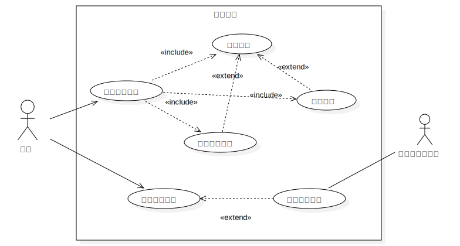

# 修订历史

| 编写日期  | SEPG | 版本   | 说明                   | 作者                         |
| --------- | ---- | ------ | ---------------------- | ---------------------------- |
| 2022.11.4 |      | v0.0.1 | 完成项目介绍与需求分析 | 陈元哲，方仪，白珂睿，高骏骋 |

# 目录

[TOC]

# 1 介绍

随着经济的发展与人们生活水平的提高，线下演出，现场体验是越来越受欢迎的娱乐方式。演出作为文化产业的终端输出方式，涉及娱乐、音乐、电影、体育、游戏等创意文化产业。票务是线下演艺行业对消费者的“门面”，是消费者对文化内容消费的第一步，对形成良好的消费体验直观重要。近年来互联网技术的发展，让更多人选择线上购票的方式。我们希望以此为契机，打造一个由票务链接的演艺生态圈，让用户获得更好的票务消费体验，瞄准用户痛点，创造一个更好的互联网票务环境。

本项目包括商家、用户、管理员三个主体。核心功能为商家与用户之间的票务交易，我们引入了与票务产品互相绑定的现场分享功能，既是用户对演出美好瞬间的记录也是对商家演出的评价与反馈。针对传统购票平台出现的黄牛倒卖导致的购票难、用户个人原因无法参与演出而导致的转卖难等问题，我们做出功能性的优化，充分保障消费者的权益。为了维护良好的社区氛围，我们引入了管理员角色，为演出的举办以及用户发布的分享等信息进行审核，保障一个健康的互联网交流环境。

项目的名称为“一排一座”，指的是剧场中第一排离演员最近的位置，通常是预留给演员们的赠票以邀请对他们而言重要的客人。每一位用户都是我们珍视的对象，我们希望我们的服务能带给我们的用户一排一座的体验。

# 4 需求调研

因疫情原因等限制，我们采用了线上调查问卷的方式开展项目的需求调研，我们将问卷发布主要到了微信朋友圈，共收集了68份有效问卷，并对需求做出了总结。

我们共制定了十道题目，问题如下：

- 您的所在城市是

- 您的年龄是

- 您观看线下演出（电影，戏剧，体育比赛，演唱会，livehouse等）的频次是（非疫情时期）

- 请您将以下用户痛点排序（对您影响较大的在前）

- 您买过黄牛票吗

- 您购买的黄牛票存在溢价吗

- 您对黄牛的态度是

- 您遇到过购票后因个人或不可抗力无法观看的情况吗

- 您是如何处理无法观看的门票的

- 您希望购票平台出现哪些新功能

针对收集到的问题，我们依次进行了调研分析，寻找用户的主要需求等

（1）您的所在城市是

本题可能一定程度上有一定的偏差，主要基于学校所在地等因素，但仍不难看出我们的受众更多分布在经济较为发达地区，例如浙江三名用户所在地都来自于杭州

基于此，我们的“一排一座”购票平台将按地区，更多的进行一二线城市演出的曝光和售票，满足广大用户的需求。

（2）您的年龄是

受众用户主要是大学生、研究生等年轻人，也有中老年人的参与，因此我们提供的票务服务应该多种多样，在满足大部分青年群体需求的同时，也要服务于不同年龄层次的用户。

（3）您观看线下演出（电影，戏剧，体育比赛，演唱会，livehouse等）的频次是（非疫情时期）

大多数用户都保持一年2-5次观演频率，更有超过33%的用户评价每月就要观演1次以上，可以看出项目有较大的发展潜力和用户基础。

（4）请您将以下用户痛点排序（对您影响较大的在前）

超过69%的受访者都将抢票困难放在了第一位，紧随其后的是宣传信息的缺失、用户交流和转卖困难等。根据受访者的反馈，我们应该在这方面满足用户需求，如开放用户专卖，设置用户交流论坛，将演出信息及时公布等，最大可能满足用户痛点需求。

（10）您希望购票平台出现哪些新功能

根据对于问卷的分析，我们可以看到大部分的受访者都认为当前的平台应提供退票或转卖票的服务，尤其是在疫情环境下，可能会时有因各种原因不能到场的情况，需减小用户的损失，这也是我们平台要实现的特色，增加票务转卖功能。

# 5 功能性需求描述

## 5.2 注册登录系统

在注册登录系统中，主要应当完成以下功能需求：

1. 游客可以通过填写手机号码等信息，注册成为票务平台用户
2. 游客可以通过手机号登录为用户
3. 对于系统赋予权限的管理员账号，也可以通过用户名和密码进行登录

### 5.2.1 注册用例分析

| 用例              | 注册                                                         |
| ----------------- | :----------------------------------------------------------- |
| ID                | UC01                                                         |
| Specification     | 游客填写基本信息并注册为用户                                 |
| Actors            | 游客                                                         |
| Pre-condition     | 游客打开票务平台，进入注册页面                               |
| Flow of Events    | 1. 游客进入注册页面，以下情况会导致游客进入注册页面   1.1 游客点击页面中“注册”按钮   1.2 游客进行了需要登录用户才能执行的权限操作，进入了登录界面，经过系统指引后进入注册界面 2. 用户填写基本注册信息: &nbsp;&nbsp;2.1 用户填写手机号码并选择自己的常驻城市 &nbsp;&nbsp;2.2 用户设置昵称与密码 3. 系统验证用户填写的手机号格式是否正确以及手机号是否被注册 4. 用户点击“发送验证码”按钮，之后填写从手机短信上获得的验证码 5. 系统验证并记录用户的信息，返回状态信息 6. 注册用例结束 |
| Alternative Flows | 1. 用户可在注册的任何阶段关闭/退出页面 2. 用户在注册时可能会出现的错误 &nbsp;&nbsp;2.1 用户输入错误的手机号 &nbsp;&nbsp;&nbsp;&nbsp;&nbsp;&nbsp;&nbsp;&nbsp;&nbsp;系统将会提示“错误的手机号”并返回注册页面 &nbsp;&nbsp;2.2 用户输入已注册的手机号 &nbsp;&nbsp;&nbsp;&nbsp;&nbsp;&nbsp;&nbsp;&nbsp;&nbsp;系统将会提示“改手机号已注册”并返回注册页面 &nbsp;&nbsp;2.3 用户未收到验证码 &nbsp;&nbsp;&nbsp;&nbsp;&nbsp;&nbsp;&nbsp;&nbsp;&nbsp;系统允许用户在30s后重新发送一次验证码 &nbsp;&nbsp;2.4 用户输入了错误的验证码 &nbsp;&nbsp;&nbsp;&nbsp;&nbsp;&nbsp;&nbsp;&nbsp;&nbsp;系统提示“错误的验证码”，之后用户可以重新输入验证码 |
| Post-condition    | 用户获得了一个账户，并成为已注册用户。                       |

### 5.2.2 登录用例分析

|用例|登录|
|---|:---|
|ID|UC02|
|Specification|游客输入手机号与密码\手机号与短信认证登录账户|
|Actors|游客|
|Pre-condition|游客打开票务平台，进入登录页面|
|Flow of Events|1. 游客进入登录界面，以下情况会导致游客进入登录界面   1.1 游客点击页面中“登录”按钮   1.2 游客进行了需要登录用户才能执行的权限操作 2. 用户可选择登录方式，使用手机号与密码登录以及使用手机号短信认证登录，默认为使用手机号与密码登录   2.1 选择手机号与密码登录，用户填写手机号与密码   2.2 选择手机号与短信验证登录，用户填写手机号后点击“发送验证码”按钮 3. 用户点击“登录”按钮，系统对用户输入信息进行验证，返回状态信息 4. 用户根据登录状态决定下一步操作 5. 登录用例结束|
|Alternative Flows|1. 用户可在登录的任何阶段关闭/退出页面  2. 用户输入错误的账户信息 &nbsp;&nbsp;2.1 用户输入了无效的手机号 &nbsp;&nbsp;&nbsp;&nbsp;&nbsp;&nbsp;&nbsp;&nbsp;&nbsp;系统拒绝登录，并提示"不存在的账户" &nbsp;&nbsp;2.2 用户输入错误的密码 &nbsp;&nbsp;&nbsp;&nbsp;&nbsp;&nbsp;&nbsp;&nbsp;&nbsp;系统拒绝登录，并提示"错误的密码" &nbsp;&nbsp;2.3 用户输入三次错误的密码后 &nbsp;&nbsp;&nbsp;&nbsp;&nbsp;&nbsp;&nbsp;&nbsp;&nbsp;系统登录时要求用户输入图片验证码 3. 用户点击”忘记密码“按钮 &nbsp;&nbsp;&nbsp;&nbsp;&nbsp;&nbsp;&nbsp;&nbsp;&nbsp;用户进入找回密码流程|
|Post-condition|游客身份转换为已登录用户|

### 5.2.3 找回密码用例分析

| 用例              | 找回密码                                                     |
| ----------------- | :------------------------------------------------------------ |
| ID                | UC03                                                         |
| Specification     | 游客忘记了自己的账号密码，重设密码                           |
| Actors            | 游客                                                         |
| Pre-condition     | 游客拥有一个已注册的账户                                     |
| Flow of Events    | 1. 游客进入网站，点击“找回密码”按钮 2. 用户输入手机号，点击“发送验证码”按钮 3. 第三方平台验证信息，若验证码正确可进行下一步操作 4. 用户输入新密码，并进行二次确认 5. 找回密码用例结束 |
| Alternative Flows | 1. 用户可在找回密码的任何阶段关闭/退出页面 2. 用户输入错误的账户信息 &nbsp;&nbsp;1.1 用户输入了无效的手机号 &nbsp;&nbsp;&nbsp;&nbsp;&nbsp;&nbsp;&nbsp;&nbsp;&nbsp;系统拒绝验证，并提示"不存在的账户" &nbsp;&nbsp;1.2 用户在二次确认时输入错误的密码 &nbsp;&nbsp;&nbsp;&nbsp;&nbsp;&nbsp;&nbsp;&nbsp;&nbsp;系统拒绝密码找回，并提示"错误的密码"  |
| Post-condition    | 用户重设了账户密码，游客身份转换为已登录用户                 |

### 5.2.4 短信验证码验证用例分析

| 用例              | 短信验证码验证                                               |
| ----------------- | :------------------------------------------------------------ |
| ID                | UC04                                                         |
| Specification     | 在注册、登录、找回密码时，用户需要SMS短信安全认证            |
| Actors            | 游客                                                         |
| Pre-condition     | 游客在所处的注册、登录、找回密码界面进行短信认证             |
| Flow of Events    | 1. 用户按照提示输入手机号，点击“发送验证码”按钮 2. 系统检查用户输入手机格式，若格式正确且符合其它前置条件，则向第三方认证平台接口发送用户手机号 3. 第三方平台向用户手机发送验证码短信 4. 用户填写收到的验证码，并点击“确认”按钮 5. 短信验证码验证用例结束 |
| Alternative Flows | 1. 用户可在短信验证码验证的任何阶段关闭/退出页面 2. 验证过程出现异常 &nbsp;&nbsp;1.1 用户输入了无效的手机号 &nbsp;&nbsp;&nbsp;&nbsp;&nbsp;&nbsp;&nbsp;&nbsp;&nbsp;系统拒绝验证，并提示"不存在的账户" &nbsp;&nbsp;1.2 用户在二次确认时输入错误的密码 &nbsp;&nbsp;&nbsp;&nbsp;&nbsp;&nbsp;&nbsp;&nbsp;&nbsp;系统拒绝密码找回，并提示"错误的密码"   1.3 用户未收到验证码 &nbsp;&nbsp;&nbsp;&nbsp;&nbsp;&nbsp;&nbsp;&nbsp;&nbsp;系统允许用户在30s后重新发送一次验证码 &nbsp;&nbsp;1.4 用户输入了错误的验证码 &nbsp;&nbsp;&nbsp;&nbsp;&nbsp;&nbsp;&nbsp;&nbsp;&nbsp;系统提示“错误的验证码”，之后用户可以重新输入验证码或等待30s后重新发送验证码  |
| Post-condition    | 用户经验证后被赋予了相关操作权限                             |

## 5.5 票务信息系统

在票务信息系统中，主要应当完成以下功能需求：

1. 游客和用户可以浏览查看感兴趣的演出的详情，包括其时间、地点、票价、场次、详细介绍、图片等信息。

2. 用户可以查看演出的场次与票档，选择后可以看当前已选择的对应场次与票档是否有余票，如果有可以发起创建订单。

3. 用户可以随时取消选择的场次和票档。

4. 用户进行订单创建，可以选择座位、支付方式、观演人信息等多种信息，并可以在每一步取消订单创建。

5. 用户可以阅读《订票协议》，如同意协议则可提交订单，等待平台审批。

### 5.5.1 选择场次与票档用例分析

| 用例              | 选择场次与票档                                               |
| ----------------- | :----------------------------------------------------------- |
| ID                | UC                                                           |
| Specification     | 用户在演出详情页可以点击选择自己心仪的演出的场次和票档       |
| Actors            | 用户                                                         |
| Pre-condition     | 游客点击后进行登录才能继续选择；用户可在演出详情页直接选择   |
| Flow of Events    | 1. 用户查看详情页，选择自己喜欢的场次和票档 2. 用户分别点击场次和票档的按钮进行选择 3. 用户提交选择继续进行后续订单操作，或取消选择  |
| Alternative Flows | 1. 用户可在选择场次与票档的任何阶段关闭/退出页面 2. 用户在选择场次与票档时可能会出现的错误 &nbsp;&nbsp;2.1 用户选择的场次票档已无余票 &nbsp;&nbsp;&nbsp;&nbsp;&nbsp;&nbsp;&nbsp;&nbsp;&nbsp;系统将会提示“该场次下该票档已无余票”并返回详情页面  |
| Post-condition    | 无                                                           |

### 5.5.2 创建订单用例分析

| 用例              | 创建订单                                                     |
| ----------------- | :----------------------------------------------------------- |
| ID                | UC                                                           |
| Specification     | 用户在选择好场次和票档后进入订单创建步骤，经过选座、选观演人、配送方式、支付方式后，同意订票协议并提交订单完成订单的创建 |
| ctors             | 用户                                                         |
| Pre-condition     | 用户完成场次和票档的选择                                     |
| Flow of Events    | 1. 用户进入选座界面 2. 用户点击想选择的座位，会显示点击座位的位置和价格，点击确定按钮确定座位 3. 用户确定座位后跳转确认其他信息的界面: &nbsp;&nbsp;3.1 用户选择观演人（个人信息中已添加的观演人），将显示观演人姓名和手机号 &nbsp;&nbsp;3.2 用户选择配送方式 &nbsp;3.3 用户选择支付方式并支付 4. 用户点击订票协议可以查看协议，勾选后可以点击提交订单按钮提交订单，订单会生成并提交给系统  |
| Alternative Flows | 1. 用户可在创建订单的任何阶段关闭/退出页面 2. 用户在创建订单时可能会出现的错误 &nbsp;&nbsp;2.1 网络错误/信息加载错误 &nbsp;&nbsp;&nbsp;&nbsp;&nbsp;&nbsp;&nbsp;&nbsp;&nbsp;系统将会提示“演出详情加载失败”并返回主页面 &nbsp;&nbsp;2.2 用户选择已被选定的座位后点击“确定” &nbsp;&nbsp;&nbsp;&nbsp;&nbsp;&nbsp;&nbsp;&nbsp;&nbsp;系统将会提示“该座位已被预订” &nbsp;&nbsp;2.3 用户未勾选“已阅读订票协议”就提交订单 &nbsp;&nbsp;&nbsp;&nbsp;&nbsp;&nbsp;&nbsp;&nbsp;&nbsp;系统会提示用户“请先阅读《订票协议》” &nbsp;&nbsp; |
| Post-condition    | 订单交由管理员审核，审核通过后将显示在个人中心-我的订单中    |

### 5.5.3 查看演出详情用例分析

| 用例              | 查看演出详情                                                 |
| ----------------- | :----------------------------------------------------------- |
| ID                | UC                                                           |
| Specification     | 游客和用户点击感兴趣演出，浏览并查看其详细信息               |
| Actors            | 游客，用户                                                   |
| Pre-condition     | 用户在首页浏览首页演出或搜索演出信息                         |
| Flow of Events    | 1. 用户点击感兴趣的演出，进入其详情单 2. 将会显示演出的详细信息，包括时间、地点、参演者、剧照等，以及场次和票价  |
| Alternative Flows | 1. 用户可在查看演出详情的任何阶段关闭/退出页面 2. 用户在查看演出详情时可能会出现的错误 &nbsp;&nbsp;2.1 网络错误/信息加载错误 &nbsp;&nbsp;&nbsp;&nbsp;&nbsp;&nbsp;&nbsp;&nbsp;&nbsp;系统将会提示“演出详情加载失败”并返回主页面 3.用户在此页面进行场次和票档的选择 |
| Post-condition    | 无                                                           |

## 5.6 转卖系统

在转卖系统中，应该满足以下的需求：

1. 对于用户已购买的、还在期限内的未入场有效票卷，由于票务的特殊性，不能像其他商品进行直接退款，应该提供用户转卖的平台。
2. 对于一场演出，购票用户可以获得其他用户的转卖信息，用户能够购买转卖票。
3. 用户可以管理自己的转卖信息，当票还未卖出时，能够撤销自己的转卖信息。
4. 对于通过转卖方式购买的票卷，禁止二次转卖
5. 转卖功能仅为用户提供购票后因个人原因缺席的便利，减小用户购票的门槛，用户需同意《一座一排平台票务转卖守则》才能进行转卖。

### 5.6.1 创建转卖用例分析

| 用例              | 创建转卖                                                     |
| ----------------- | :----------------------------------------------------------- |
| ID                | UC                                                           |
| Specification     | 用户将已购买的、还在期限内的未出场有效票卷放入转卖平台进行转卖 |
| Actors            | 用户                                                         |
| Pre-condition     | 用户拥有一个已购买的、还在期限内的未出场有效票卷订单         |
| Flow of Events    | 1. 用户进入个人中心页面，进入“我的订单”页面，在符合条件的订单卡片中，用户点击“一键转卖”按钮 2. 用户设置转卖的价格/截至兑换期限(转卖的最晚有效时间，在演出开始之前) 3. 用户阅读《一座一排平台票务转卖守则》并勾选同意后，转卖生效 4. 创建转卖用例结束 |
| Alternative Flows | 1. 用户可在创建转卖用例的任何阶段关闭/退出页面 2. 用户在票务转卖时可能会出现的错误 &nbsp;&nbsp;2.1 网络错误/信息加载错误 &nbsp;&nbsp;&nbsp;&nbsp;&nbsp;&nbsp;&nbsp;&nbsp;&nbsp;系统将会提示“加载失败”并返回主页面   2.2 创建转卖时间过晚          为保证转卖系统的正常运行，系统会设置在演出开始前的最晚转卖时间，超过此时间后，订单卡片中不会出现“一键转卖”按钮。并且未生效的转卖也将出现提示信息并作废 3. 用户没有勾选转卖守则的同意，弹出提示信息，转卖不予生效 |
| Post-condition    | 无                                                           |

### 5.6.2 管理转卖信息用例分析

| 用例              | 管理转卖信息                                                 |
| ----------------- | :----------------------------------------------------------- |
| ID                | UC                                                           |
| Specification     | 用户管理自身已生效的转卖信息，可修改或删除转卖信息           |
| Actors            | 用户                                                         |
| Pre-condition     | 用户拥有已生效的转卖信息                                     |
| Flow of Events    | 1. 用户进入个人中心页面，进入“我的转卖”页面 2. 用户点击需要管理的转卖卡片 3. 用户可更改转卖的价格以及截至兑换期限，也可以删除转卖 4. 用户更改结束后点击“保存更改”按键，系统返回更改结果 5. 管理转卖信息用例完成 |
| Alternative Flows | 1. 用户可在管理转卖信息的任何阶段关闭/退出页面 2. 用户在管理转卖信息时可能会出现的错误 &nbsp;&nbsp;2.1 网络错误/信息加载错误 &nbsp;&nbsp;&nbsp;&nbsp;&nbsp;&nbsp;&nbsp;&nbsp;&nbsp;系统将会提示“加载失败”并返回主页面   2.2 转卖信息保存失败          用户将返回转卖信息编辑界面，系统提示“网络错误，请重新提交”  |
| Post-condition    | 无                                                           |

### 5.6.3 浏览转卖信息用例分析

| 用例              | 浏览转卖信息                                                 |
| ----------------- | :----------------------------------------------------------- |
| ID                | UC                                                           |
| Specification     | 用户可以在浏览演出票务信息时可以浏览对应的用户发布的转卖信息 |
| Actors            | 用户                                                         |
| Pre-condition     | 用户已登录，游客无法查看转卖信息                             |
| Flow of Events    | 1. 用户进入售票平台，进入到演出详情页面 2. 用户可在该页面查看系统推荐的转卖信息 3. 用户可点击“更多”按钮查看有关演出的所有转卖信息 4. 用户可按场次/票档/票价等信息筛选转卖信息  |
| Alternative Flows | 1. 用户可在浏览转卖信息的任何阶段关闭/退出页面 2. 用户在管理转卖信息时可能会出现的错误 &nbsp;&nbsp;2.1 网络错误/信息加载错误 &nbsp;&nbsp;&nbsp;&nbsp;&nbsp;&nbsp;&nbsp;&nbsp;&nbsp;系统将会提示“加载失败”并返回主页面   2.2 转卖截至时间已到          此时所有有关演出的转卖信息将失效，不会显示任何转卖信息 3. 用户可以点击任意转卖信息进入转卖详情界面，并进行购买操作 |
| Post-condition    | 无                                                           |

### 5.6.4 购买转卖票卷

| 用例              | 浏览转卖信息                                                 |
| ----------------- | :----------------------------------------------------------- |
| ID                | UC                                                           |
| Specification     | 用户在浏览转卖信息后可以购买转卖票卷                         |
| Actors            | 用户                                                         |
| Pre-condition     | 用户进入了转卖信息页面                                       |
| Flow of Events    | 1. 用户进入售票平台，进入转卖信息页面，点击“购买” 2. 用户用户阅读《一座一排平台票务转卖守则》并勾选同意后进入第三方平台支付页面 3. 用户在第三方平台支付成功后，系统执行转卖交易操作 4. 购买转卖票卷用例结束  |
| Alternative Flows | 1. 用户可在购买转卖票卷的任何阶段关闭/退出页面 2. 用户在购买转卖票卷时可能会出现的错误 &nbsp;&nbsp;2.1 网络错误/信息加载错误 &nbsp;&nbsp;&nbsp;&nbsp;&nbsp;&nbsp;&nbsp;&nbsp;&nbsp;系统将会提示“加载失败”并返回主页面   2.2 转卖截至时间已到          此时所有有关演出的转卖信息将失效，点击“购买”不会进行购买动作，强制刷新页面   2.3 用户支付失败          此时转卖状态恢复，页面回到转卖信息页面  |
| Post-condition    | 卖出者在“我的转卖”中可看到自己的转卖情况为“售出”，买入者在“我的订单”中可以看到购入的订单。 |

