# 修订历史

| 编写日期   | SEPG | 版本   | 说明             | 作者                         |
| ---------- | ---- | ------ | ---------------- | ---------------------------- |
| 2022.11.16 |      | v0.0.1 | 完成引言部分     | 陈元哲，方仪，白珂睿，高骏骋 |
| 2022.11.20 |      | v0.0.2 | 完成数据建模     | 陈元哲，方仪，白珂睿，高骏骋 |
| 2022.12.10 |      | v0.0.3 | 完成非功能性需求 | 陈元哲，方仪，白珂睿，高骏骋 |
|            |      |        |                  |                              |
|            |      |        |                  |                              |
|            |      |        |                  |                              |
|            |      |        |                  |                              |
|            |      |        |                  |                              |

# 目录

[TOC]

# 1 引言

## 1.1 背景

本项目名为“一排一座”，指的是剧场中第一排离演员最近的位置，通常是预留给演员们的赠票以邀请对他们而言重要的客人。我们希望项目能够为移动端用户带来“一排一座”的使用体验。用户通过平台可以实现线上购票，在平台上分享自己的观影心得，并通过其他相关的功能获得更好的体验。

本项目任务的提出者为软件工程课程设计需要；开发者为软件工程专业四名同学（陈元哲，方仪，白珂睿，高骏骋）；项目预期用户是有购票、转卖票务以及观影心得交流的需求的人员。

为了更好的实现所需要的业务逻辑，本系统调用了其他系统的接口以更好地完成本系统的功能。包括图片验证码生成接口、手机号实名认证接口、身份证号实名认证接口、支付二维码的生成接口等。

## 1.2 参考资料

1. 《Vue.js 实战》

2. 《JavaScript设计模式》

3. 《项目计划、进度与控制》

## 1.3 假定约束

本项目的假定和约束如下所示：

1. 项目开发期限为1个月，时间为2021年11月底~12月底；

2. 项目开发无经费，设备条件为3台Windows操作系统电脑和1台Mac操作系统电脑；

3. 项目开发者通过YouTrack进行项目管理，并通过Github进行代码协作管理。

# 2 功能需求

## 2.1 系统范围

本项目的项目范围包括用户和管理员两个主题。核心主体是由管理员创建的演出票务，在票务上的创建、编辑、搜索等操作，涉及到数据库层面的增删改查。而针对票务的电子订单的交易则是本系统的核心功能，在核心功能的基础上实现了用户间的票务转卖交易以及现场分享功能，为社区内的用户提供了消费的便利与交流的平台。最后，我们针对现存的黄牛问题做出了算法上的限制，致力于维护一个公平健康的平台环境。

## 2.2 系统体系结构

一排一座票务平台系统采用了微服务的架构风格，将用户信息、票务管理、转卖、订单、分享等不同功能集合划分到不同的微服务中，下图为架构设计图：

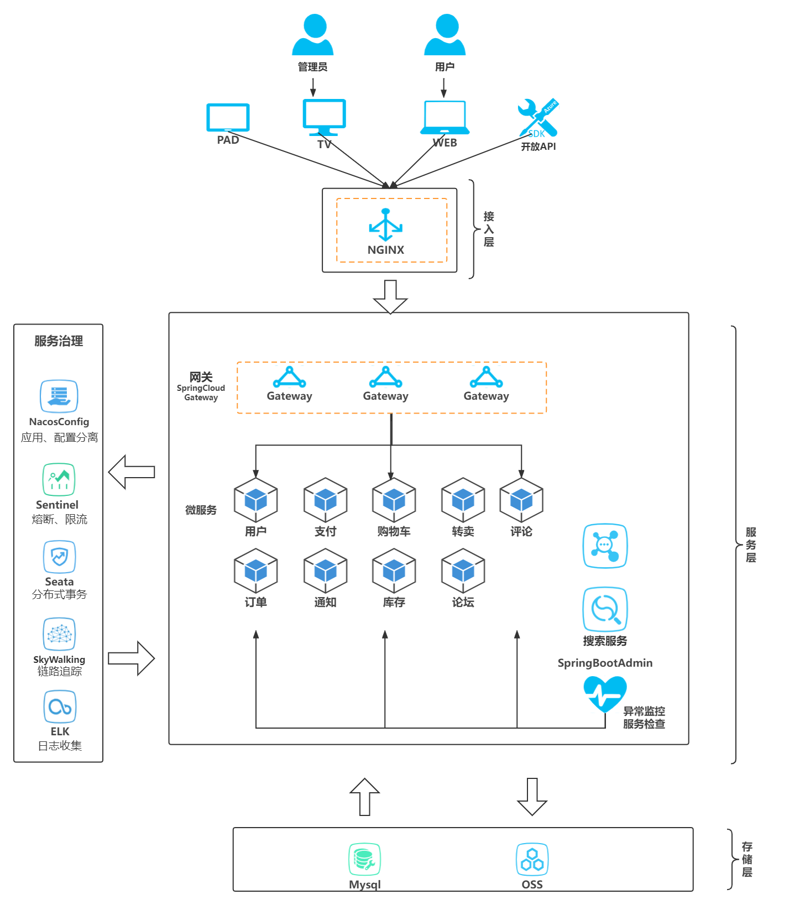

## 2.3 系统总体流程

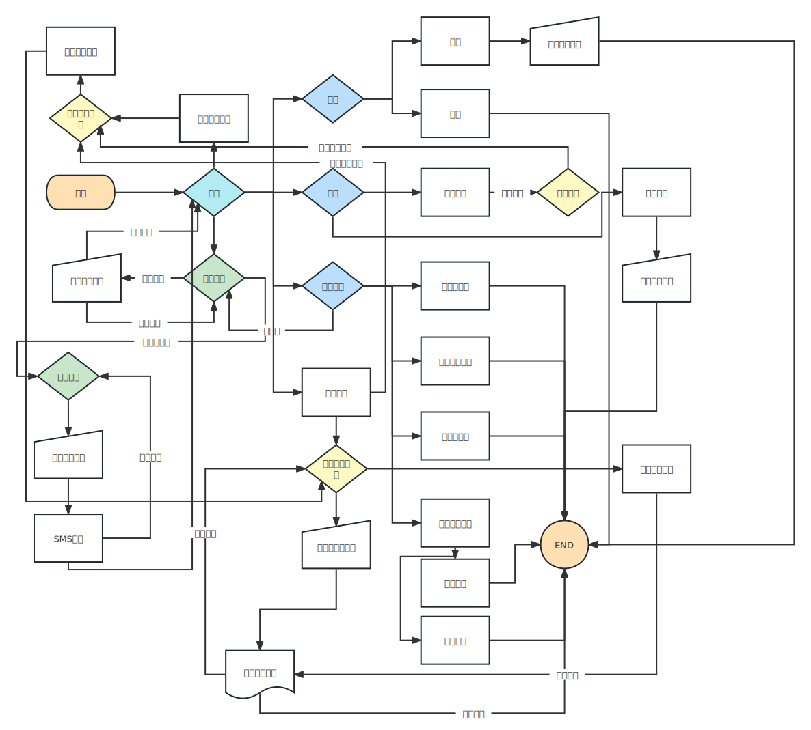

## 2.4 需求分析

## 总览

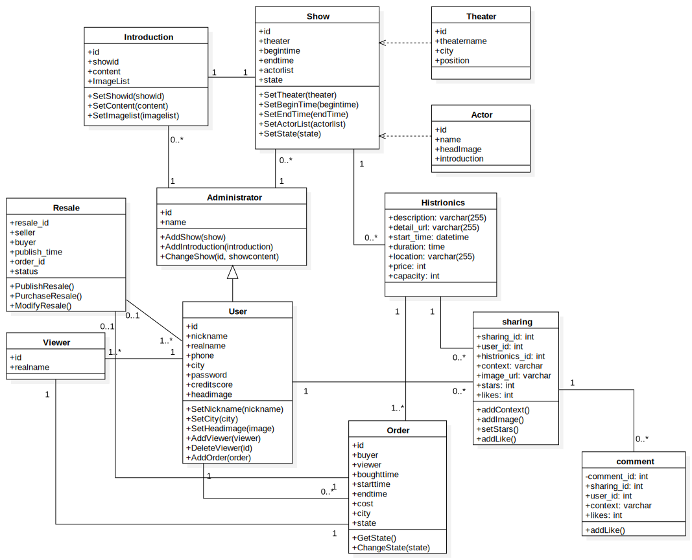

## 注册与登录系统

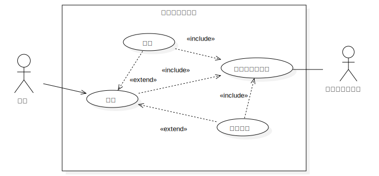

### 2.4.1 整体数据建模

登录与注册系统中，需要将游客输入的数据与数据库中的用户数据进行比对，根据对比的信息给予用户相应的提示，在数据建模中，应留有对应的属性与相应的接口。

### 2.4.2 功能建模

#### 2.4.2.1 用户登录用例

用户在登录页面可以通过点击按钮进入到注册或者找回密码界面。在登录时，可以选择手机号和账户密码以及手机号和短信验证两种方式进行登录。

#### 2.4.2.2 用户注册用例

#### 2.4.2.3 找回密码用例

### 2.4.3 行为建模

User类的状态转换如下图所示

RegisterMessage类的状态转换如下图所示

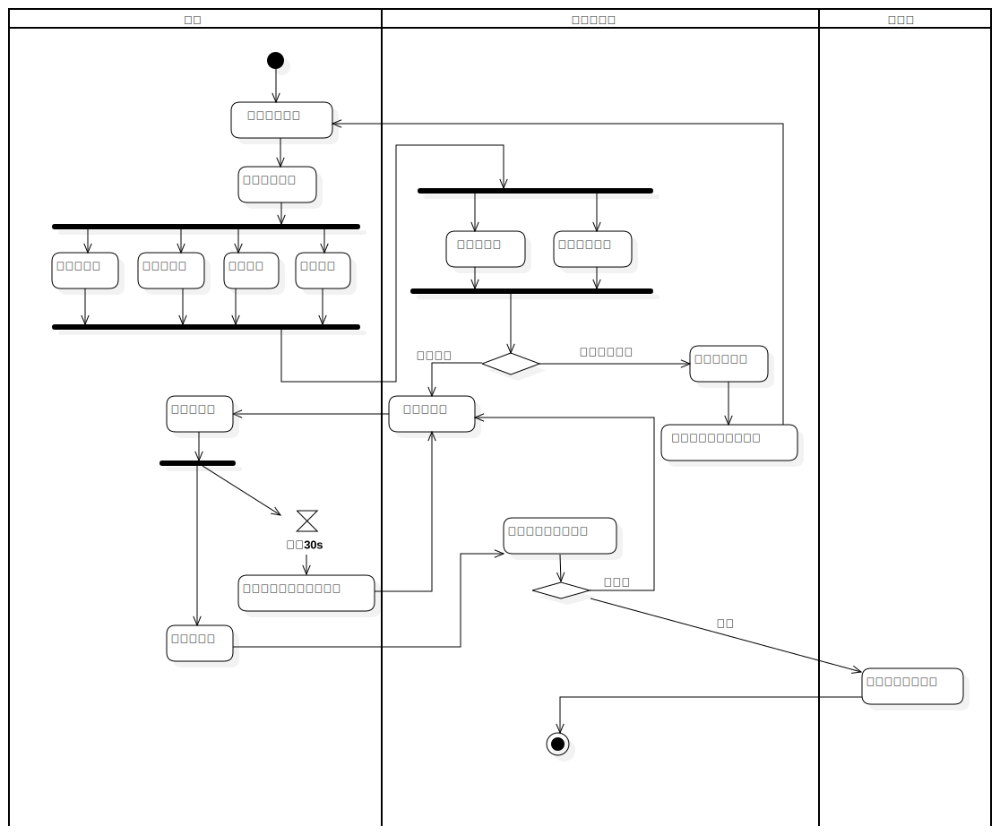

## 用户信息系统

### 2.4.4 整体数据建模

在本模块，需要建模的数据来自于用户、观演人以及订单。用户可以进行查看并修改个人信息，选择增添或删除自己的观演人，查看自己的订单等操作。数据建模为这些操作均提供了对应的接口。

### 2.4.5 功能建模

#### 2.4.5.1 修改用户信息用例

在用户个人信息界面可以修改用户的个人信息，在用户进入个人信息界面之前系统将会检查用户是否已登录。

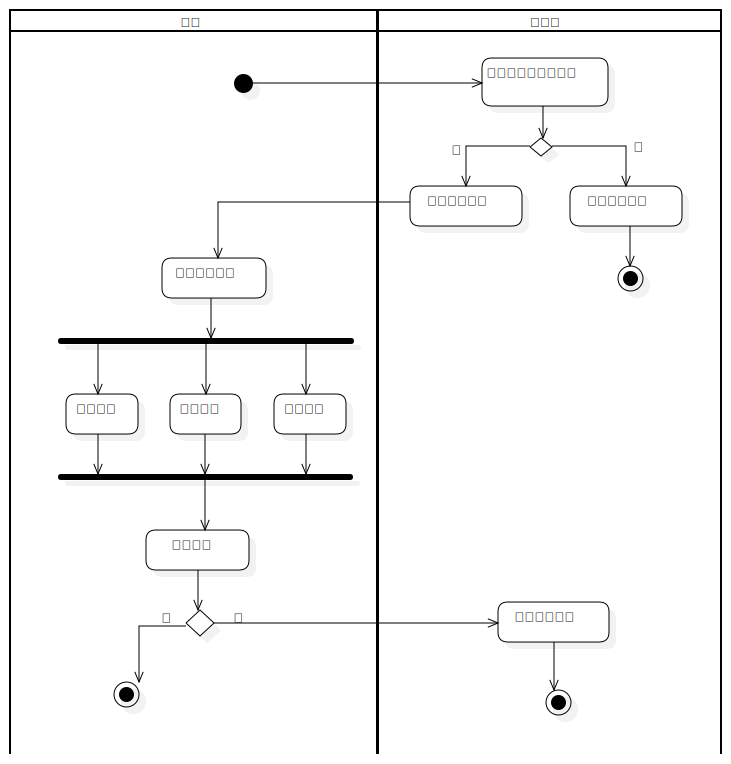

#### 2.4.5.2 查看我的订单用例

用户在个人信息界面可以点击进入我的订单界面，在订单列表选择点击一个订单，可以看到该订单的详细信息。

#### 2.4.5.2 管理观演人用例

用户在个人信息界面可以进入到观演人界面，在此可以选择增添或删除观演人。

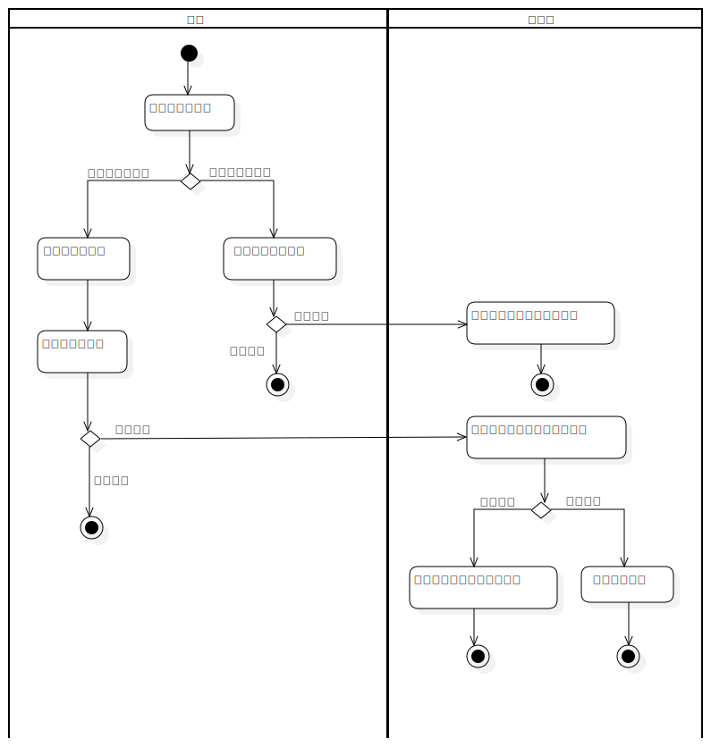

### 2.4.6 行为建模

Viewer类的状态转换如下图所示

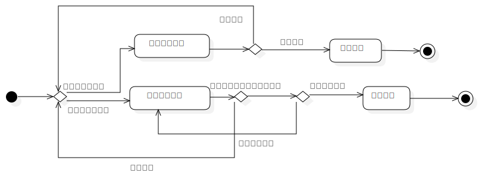

User类的状态转换如下图所示

## 首页系统

### 2.4.7 整体数据建模

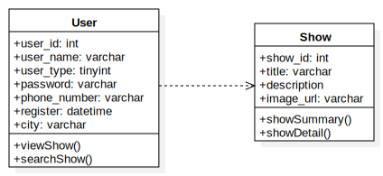

### 2.4.8 功能建模

#### 2.4.8.1 筛选用户信息用例

#### 2.4.8.2 浏览首页内容用例

#### 2.4.8.3 搜索演出内容用例

### 2.4.9 行为建模

其中搜索潜在类的状态图如下

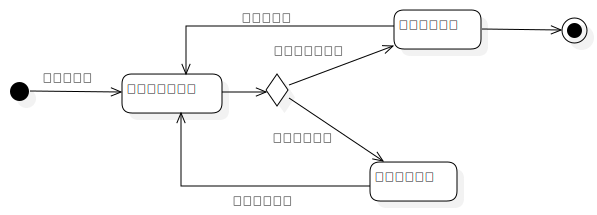

## 票务信息系统

### 2.4.10 整体数据建模

票务信息系统中，游客或用户可以浏览首页显示的演出信息，并根据分类等进行选择，点击查看其详细信息。在数据建模中，应留有对应的属性与相应的接口。

### 2.4.11 功能建模

#### 2.4.11.1 查看演出详情用例

游客和用户点击感兴趣演出，浏览并查看其详细信息。活动图如下所示

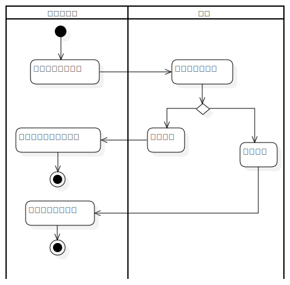

#### 2.4.11.2 选择场次与票档用例

用户在演出详情页可以点击选择自己心仪的演出的场次和票档。活动图如下所示

#### 2.4.11.3 创建订单用例

用户在选择好场次和票档后进入订单创建步骤，经过选座、选观演人、支付方式后，经过系统的信誉度检测，同意订票协议并提交订单完成订单的创建。活动图如下所示：

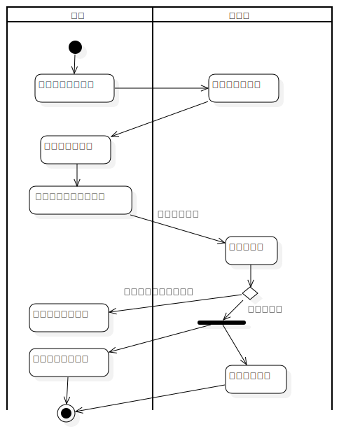

### 2.4.12 行为建模

订单类的状态图如下：

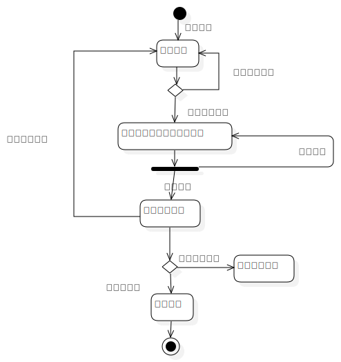

## 转卖系统

### 2.4.13 整体数据建模

在本模块中，主要对转卖订单进行数据建模。用户可以针对已经购买的订单发布转卖，用户可以浏览并购买转卖。在发布转卖之后，用户可以修改或取消转卖信息。

### 2.4.14 功能建模

### 2.4.15 行为建模

## 票务管理系统

### 2.4.16 整体数据建模

在本模块，需要建模的数据来自于管理员、演出类、演出介绍类、剧院类以及演员类。拥有管理员权限的人员可以发布演出信息、修改演出信息与查看某一演出的售票情况。数据建模为这些功能提供了相应的接口。

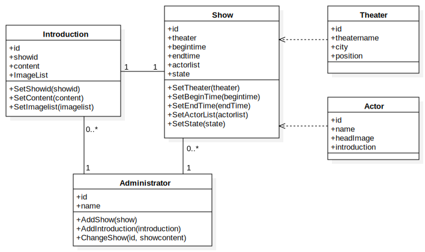

### 2.4.17 功能建模

#### 2.4.17.1 上架演出用例

管理员在完善演出信息后可将其发布，下面是上架演出用例的活动图：

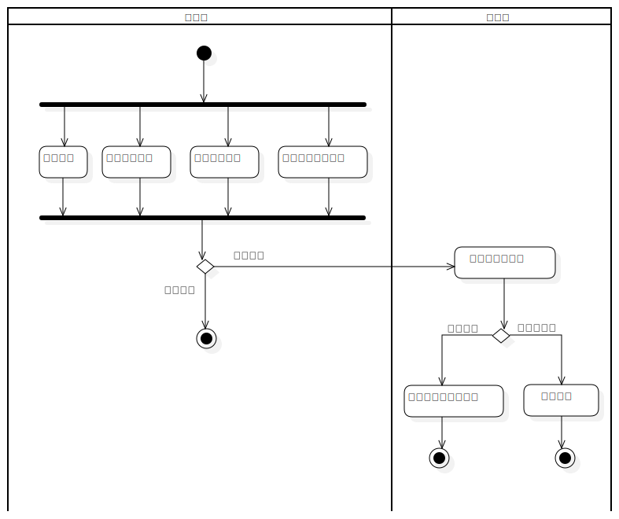

#### 2.4.17.2 修改演出信息用例

在某场演出开始之前，管理员可修改演出的信息，下面是修改演出信息用例的活动图:

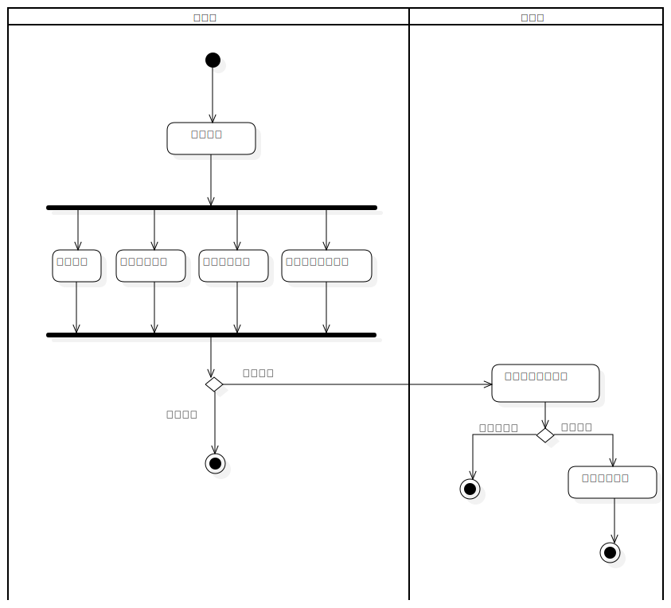

#### 2.4.17.3 查看售票情况用例

### 2.4.18 行为建模

Show类的状态转换如下图所示

Introduction类的状态转换如下图所示

## 现场分享系统

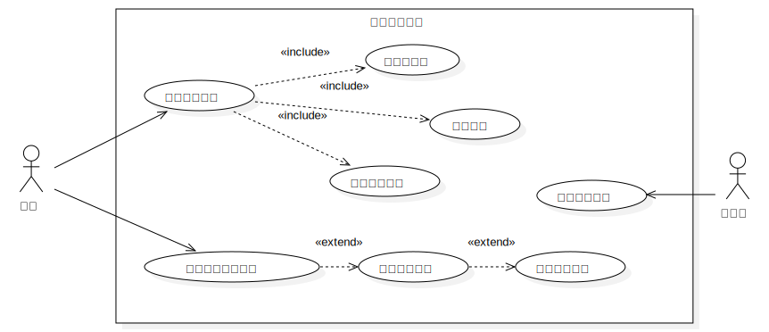

### 2.4.19 整体数据建模

### 2.4.20 功能建模

#### 2.4.20.1 发布现场用例

#### 2.4.21.2 查看现场用例

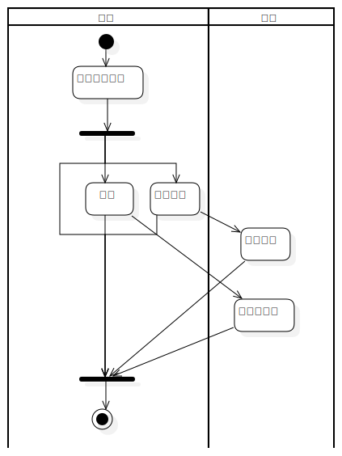

### 2.4.22 行为建模

Sharing类状态转换如下

Comment类状态转换如下

# 3 非功能需求

## 3.1 性能要求

### 3.1.1 精度

- 该软件初步设定对数据的输入输出精度的要求是小数点后3位；

- 该软件初步设定对数据的传输精度要求为小数点后3位；

- 计算的精确性要求是小数点后7位。

### 3.1.2 时间特性要求

- 对于本票务平台，在95%的情况下，一般响应时间不超过2000ms，高峰时段不超过4000ms。

- 定位系统从点击到第一个界面显示出来所需要的时间不得超过3000ms。

- 在推荐配置环境下：登录响应时间在2000ms内；首页加载响应时间在500ms内，加载票务详情界面响应时间在500ms内；刷新各页面的响应时间在1000mx内，瀑布流条目加载响应时间在2000ms内；编辑各条目时页面的刷新在1000ms内；发布票务信息后页面的响应时间在2000ms内；预定下单后页面的响应时间在5000ms内；发布分享的页面响应时间在2000ms内。

- 而在非高峰时间根据搜索字段进行票务搜索，可以在3秒内得到搜索结果；根据字段搜索分享，可以在5秒内得到搜索结果。

### 3.1.3 输入输出要求

按照功能需求划分，本平台有以下的输入输出类型

**表格1 发布房源功能需求表**

| 功能 描述 | 用户发布转卖信息                                             |
| -------------- | ------------------------------------------------------------ |
| 媒体           | 表单                                                         |
| 输入           | 转卖票务名称    格式：文本    数值范围：UTF-8编码    精度：无要求  位置    格式：UTF-8编码   数值范围：无要求   精度：无要求    转卖信息描述  格式：   数值范围：长度200以内的文本   精度：无要求   相关图片  格式：PNG文件  操作方式：在本地选择图片读取   转卖价格   格式：数值  数值范围：大于0的整数或浮点数   精度：小数点后一位   转卖截至时间   格式：时间戳   数值范围：当日以后的日期   精度：无要求   操作方式：点选时间列标 |
| 加工           | 输入数据的有效性检查  存储为本地的json文件  解析并存入数据库  对于异常情况有响应的响应方式，如错误提示，回退重新编辑等等。 |
| 输出           | 正常输出： 用户所发布转卖的文本信息，包含基本信息合图片组。   状态：发布转卖成功   异常输出：   错误的提示信息   状态：发布转卖失败 |

**表格2 发布帖子功能需求表**

| 功能描述 | 用户发布现场分享                                             |
| -------- | ------------------------------------------------------------ |
| 媒体     | 表单                                                         |
| 输入     | 现场分享名称  格式：文本  数值范围：UTF-8编码  精度：无要求   现场分享详情   格式：文本串   数值范围：长度不超过1000的文本  现场分享图片   格式：PNG文件   操作方式：在本地选择图片读取 演出打分   格式：数值 数值范围：大于0小于10的整数或浮点数   精度：小数点后一位   操作方式：点选分数  |
| 加工     | 输入数据的有效性检查  存储为本地的json文件  解析并存入数据库  等待管理员对现场分享 进行审核  若审核通过，则内容发布；若审核不通过，则退回提示修改  对于异常情况有响应的响应方式，如错误提示，回退重新编辑等等。 |
| 输出     | 正常输出：   用户成功发布现场分享 ，现场分享，内容展示   状态：发布现场分享 成功  异常输出：   审核不通过   状态：现场分享 审核不通过 |

## 3.2 数据管理能力要求

共涉及13张表，使用mySQL云数据库存储

1. 用户信息的存储：将用户的登陆信息准确的存储到数据库中，包括数据的修改等操作

2. 基本数据的设定：设置合理的基本数据，保证票务信息系统正常运行

3. 保证信息的安全性和保密性

# 4. 运行环境规定

## 4.1 硬件环境

**服务器**

1. 处理器（CPU）：Intel(R) Xeon(R) Platinum 8269CY 2核

2. 内存容量（RAM）：4G

**移动端（以开发者的设备为例）**

1. 处理器：HUAWEI Kirin 985

2. 内存容量：128GB

**外部设备**

无特殊外部设备。

## 4.2 软件环境

**数据库服务器端**

1. 操作系统：Ubuntu 20.04

2. 数据库管理系统：Mysql

**移动端（以开发者为例）**

1. 操作系统：Android 11

## 4.3 接口

本系统在运行过程中，由于业务逻辑需要，调用了其他系统的接口以更好的 完成本系统的功能。所调用的接口，如下所示：

1. 用户进行注册时需要使用到图片验证码生成的外部接口；

2. 为了确保用户信息的真实性与可靠性，我们需要对用户信息进行验证。这将用到手机号实名认证与身份证实名认证的外部接口；

3. 用户确认订单后需进行支付，这将用到生成付款二维码的外部接口。

## 4.4 控制

该软件无需控制信号，在未登录状态下可进行部分操作。如需使用软件全部功能，需要进行登录与身份信息认证的操作。
